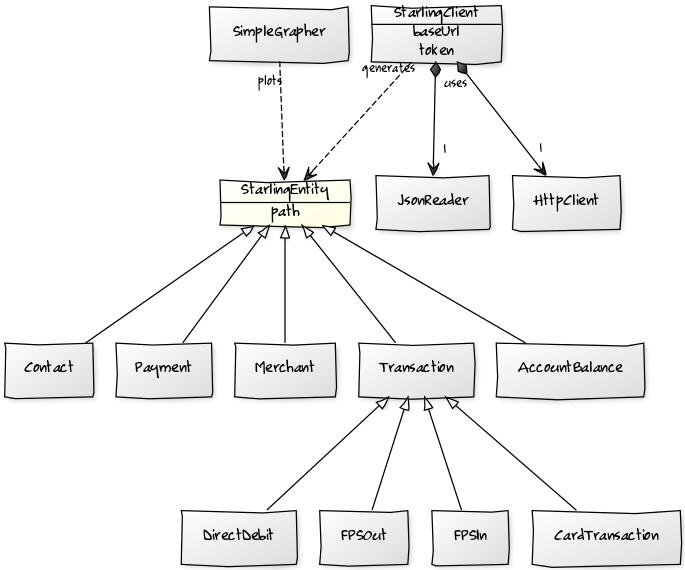
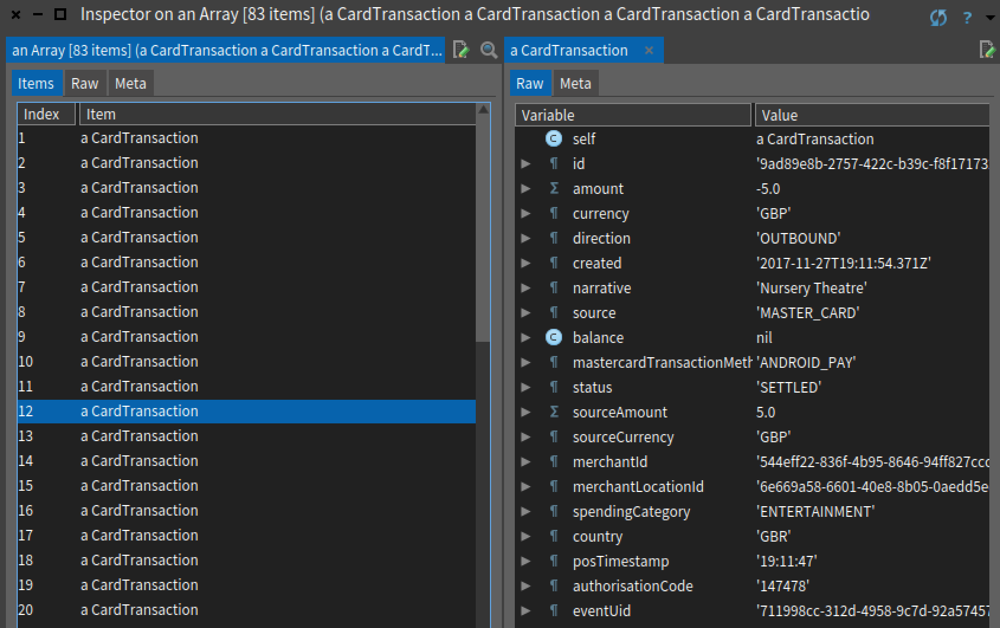
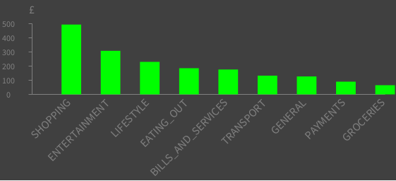
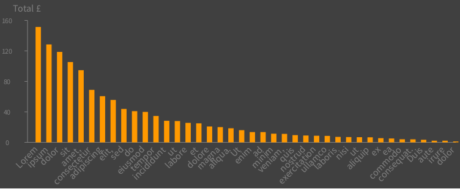
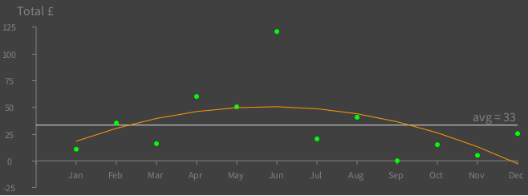
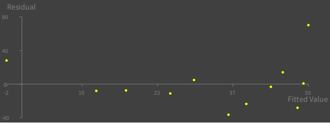

## Open APIs
It's all about open APIs in the banking industry these days. At Starling, we have built our API at the same time as our platform, not as an afterthought. We did so in spite of not being required to comply with PSD2 or Open Banking on the same timescales as the other banks. In fact, we launched the API weeks before our apps became available in the app stores. Our RESTful API is tiered. Tier 1 gives read-only access to some financial data, such as transaction history. Tier 5 includes the ability to make payments. Readers who want to experiment with the API are not required to hold an account at Starling. A sandbox environment exists where transactions can be simulated. Starling customers, however, can access their production account.

This is the first of a series of posts on the use of the Starling API. In this post, we will do an exercise with which most people are familiar: obtaining bank statements and performing some analysis on them. We are going to to write a simple SDK in [Pharo Smalltalk](http://pharo.org/). I have chosen this language for a few reasons: its simplicity; the immediate feedback provided by the environment makes it ideal for prototyping; the minimal syntax allows developers to focus on the interesting bits without becoming distracted with boiler plate. The unofficial reason is that every now and then I get nostalgic about it and I need to spin up an _image_ and hack something just for fun.

The contents of this post come from one of the weekly learning sessions held by the engineering team at Starling. This is neither a Smalltalk tutorial nor an in-depth look at the API. It is an initial exploration that I hope will encourage others to come and play with the API using their favourite language.

## Problem

Until recently, customers interested in analysing their bank statements would follow more or less these steps: log on to a bank’s website, navigate to the statements page, select a rage of dates and download a CSV file. Some people use tools like `grep`, `awk` and `sed` to preprocess the exported file before loading it into a spreadsheet. This workflow is manual, requires one’s credentials and does not scale.

Here’s what a typical statement export looks like today:

```
Date, Type, Description, Value, Balance, Account Name, Account Number
13/11/2017,POS,"'2565 10NOV17 , SPOTIFY P03F829A02, LONDON GB",-14.99,223.11,"'Current","'6*****-3*******”,
13/11/2017,D/D,"'PURE GYM LTD",-39.99,183.12,"'Current","'60****-30******”,
15/11/2017,POS,"'2565 14NOV17 , VAILLANT GROUP UK , LTD , BELPER GB",-89.00,94.12,"'Current","'6*****-3*******”,
```

In contrast to the previously stated process, the Starling API uses a token-based authentication and provides direct access to the data. You can obtain the token from the [Starling Developers website](https://developer.starlingbank.com/). Here’s an example of querying an account’s balance from the command line using `curl`:

```bash
curl -H "Authorization: Bearer $access_token" https://api.starlingbank.com/api/v1/accounts/balance

{
  "clearedBalance": 370.59,
  "effectiveBalance": 350.09,
  "pendingTransactions": 20.5,
  "availableToSpend": 1350.09,
  "acceptedOverdraft": 1000,
  "currency": "GBP",
  "amount": 370.59
}
```
Notice the lack of credentials and the structure of the response. The response is JSON text, which is easy for humans to understand and easy for programs to parse. You can find all the sample requests and their corresponding responses in the [API docs](https://developer.starlingbank.com/docs).

Our first goal is to build a Smalltalk client which wraps the network calls and uses a JSON parser to decode responses into proper objects representing things like account balance and transactions. Finally, we will write an analytic class that transforms entity data into charts.



### Client

Our client needs to know the API URL and the access token. We'll make the client read both from a properties file at construction time. Once we have a client instance, we request entities via their location path. A usage example is shown in the snippet below:

```smalltalk
client := StarlingClient new: ‘/path/to/config.properties’.
balance := client fetch: ‘/api/v1/accounts/balance’.
```

The method for reading the file and storing the configuration in a map (a `Dictionary` in Smalltalk terms) looks like this:

```smalltalk
initialize
  | file line words key value |
  configuration := Dictionary new.
  file := FileStream fileNamed: propertiesFile.
  [ [ file atEnd ]
    whileFalse: [ line := file nextLine.
      words := line splitOn: $=.
      key := words first.
      value := words second.
      configuration at: key put: value ] ]
  ensure: [ file close ]
```

Granted, the above listing is not the most exciting piece of code. It does, however, show some of Smalltalk's idiosyncrasies. Temporary variables are declared between vertical bars. They are dynamically typed. Everything is an object that responds to messages. Code within square brackets is evaluated only when a message is sent to the block. These blocks are closures which can take arguments --or not-- and are used extensively, for example when iterating over collections, or when evaluating conditionals like the `whileFalse` expression above. Apart from being a pure object language, Smalltalk is also functional.

The client can now resolve the base URL like so:

```smalltalk
baseUrl
  ^ configuration at: #'starling.baseUrl'
```

The caret symbol `^` is Smalltalk's funky way of returning. Without an explicit return, `self` is returned.

We will now work on the network call. We want a method taking a path to the requested entity. I’m using the [Zn package](http://zn.stfx.eu/zn/index.html) for handling HTTP requests. The HTTP client from this library follows a builder pattern. As previously mentioned, methods return `self` unless they explicitly return something else. Cascading is therefore very natural in Smalltalk. 

The next method creates a `GET` HTTP request, with the given headers and URL.

```smalltalk
fetch: aPath
  ^ ZnClient new
    headerAt: 'Authorization' put: 'Bearer ' , self token;
    url: self baseUrl , aPath;
    get
```

Let’s try it on a workspace, printing results on the `Transcript` (Smalltalk's console). Normally I'd favour writing unit tests over inspecting output, but the goal here is exploring, not being dogmatic about software development best practices.

```smalltalk
|client response|
client := StarlingClient new: '/Users/ricardo/starling.properties'.
response := client fetch: '/api/v1/accounts/balance'.
Transcript show: response; cr.
```

The `Transcript` shows:

```
{
 "clearedBalance": 370.59, 
 "effectiveBalance": 350.09, 
 "pendingTransactions": 20.5, 
 "availableToSpend": 1350.09, 
 "acceptedOverdraft": 1000, 
 "currency": "GBP", 
 "amount": 370.59
}
```
We’ve got the expected result back. Our next step is converting that text into an `AccountBalance` object. 

### Entities

We will use the [NeoJSON library](https://ci.inria.fr/pharo-contribution/job/EnterprisePharoBook/lastSuccessfulBuild/artifact/book-result/NeoJSON/NeoJSON.html) for parsing responses. `AccountBalance` will be our first entity definition. A class with instance variables named after the response properties will do. We need nothing but access methods at this point.

```smalltalk
StarlingEntity subclass: #AccountBalance
  instanceVariableNames: 'acceptedOverdraft amount 
    availableToSpend clearedBalance currency 
    effectiveBalance pendingTransactions'
  classVariableNames: ''
  package: 'Starling-SDK'
```

The `fetch:` method needs a few tweaks before it can decode not only `AccountBalance` objects but all the different entities. We'll make it a class-side responsibility of entities to answer the path from which they can be fetched. In Smalltalk, classes are objects, singletons in charge of creating instances of their own kind. Class-side methods are inherited and can be overridden unlike static methods in Java. 

By delegating the implementation of `path`, the `StarlingEntity` parent class becomes abstract:

```smalltalk
path
  ^ self subclassResponsibility
```

On the `AccountBalance` child class:

```smalltalk
path
  ^ #'/api/v1/accounts/balance'
```

Now we can the pass the entity class itself as an argument to `fetch:`. We'll also pass a reader to the HTTP client to decode responses. This is done with a single-argument block (effectively a lambda that is applied when a response arrives). The JSON reader maps the response properties to the entity's instance variables. Behind the scenes, the reader uses reflection.

Here's the new `fetch:` after some changes:

```smalltalk
fetch: anEntityClass
  ^ ZnClient new
    headerAt: 'Authorization' put: 'Bearer ' , self token;
    url: self baseUrl , anEntityClass path;
    contentReader: [ :response | 
      (NeoJSONReader on: response contents readStream)
        mapAllInstVarsFor: anEntityClass;
        nextAs: anEntityClass ];
    get
```

With this general-purpose method in place, we can proceed to define the rest of the entity classes. We'll need a variant of `fetch:` that can add query parameters to a request (like a date range) and parse a collection of results instead of a single object. I won't list the code here as the principle is the same as above. The inquisitive reader can look at the source code if they're interested in the details. 

We can start turning `StarlingClient` into a facade that we use like this:

```smalltalk
| client transactions |
...
transactions := client cardTransactionsFrom: '2017-11-01' to: '2017-11-30'.
transactions inspect
```

Running that snippet opens an inspector dialog:



Note that `CardTransaction` instances are categorised (`spendingCategory`) and have clean merchant names (`narrative`) as well as other useful properties. Of special interest are `merchantId` and `merchantLocationId`. With these identifiers we could call other Starling endpoints and get details such as a merchant's website, phone number or geographical location. Allow that to sink in for a moment. Think of potential applications that can correlate time, location and spending. Food for thought for another post. Let's come back to the transaction result set.

If we wanted a subset of transactions from Tesco, we could easily accomplish this in one line of code:

```smalltalk
transactions select: [ :t | t narrative = 'Tesco' ]
```

Or filter out transactions in the transport category:

```smalltalk
transactions reject: [ :t | t spendingCategory = 'TRANSPORT' ]
```

Or extract the transaction amounts:

```smalltalk
transactions collect: [ :t | t amount ]
```

Manipulating groups of objects becomes easy thanks to Smalltalk's rich collection classes and enumeration protocols. Let’s move on and do something more fun with these results, like drawing a graph. 

### Graphs

We'll build three charts: two that replicate the _spending insights_ feature of the Starling App; another one that shows the spending trend on a specific merchant. I am using the [Roassal visualisation library](http://agilevisualization.com/) to produce these graphs. In this framework, a graph is built by adding data sets to a grapher object. 

#### Monthly spending per category

The method below lives in a new class, `SimpleGrapher`. It takes a collection of `CardTransaction` objects and creates a map of totals grouped by category -- we'll zoom in on that shortly. The associations are sorted by descending value, then plotted as a bar chart.

```smalltalk
plotTotalsPerCategory: cardTransactions
  | totals sorted data grapher |
  
  "aggregate txn amounts per 'spendingCategory'"
  totals := self sum: cardTransactions groupBy: [ :t | t spendingCategory ].

  "sort the key-value pairs in descening order"
  sorted := totals associations sort: [ :a1 :a2 | a1 value > a2 value ].

  "the data set for a bar chart"
  data := RTData new.
  data barShape color: Color green.
  data points: sorted.
  data y: [ :pair | pair value ].
  data barChartWithBarTitle: [ :pair | pair key ].

  "add data set to grapher"
  grapher := RTGrapher new.
  grapher add: data.
  grapher axisX
    noTick;
    noLabel.
  ^ grapher
```

The totals map is computed like this:

```smalltalk
sum: cardTransactions groupBy: aBlock
  | totals |
  totals := Dictionary new.
  cardTransactions do: [ :t | | key sum |
    key := aBlock value: t.
    sum := totals at: key ifAbsent: [ 0 ].
    totals at: key put: sum + t amount negated ].
  ^ totals
```

We iterate over the transactions, adding the current amount to the group into which the transaction falls. The group key is determined by applying a single-argument block to the current transaction. This method could be written in a more idiomatic manner with `inject:into:`, Smalltalk's _fold_ or _reduce_ function, but I've chosen a slightly longer approach for clarity.

Putting it all together in a workspace:

```smalltalk
|client transactions graph|
. . .
transactions := client cardTransactionsFrom: '2017-11-01' to: '2017-11-30'.
graph := SimpleGrapher new plotTotalMonthlyPerCategory: transactions.
graph inspect
```



#### Monthly spending per merchant

With very little effort, we can produce aggregated spending per merchant.

```smalltalk
totals := self sum: cardTransactions groupBy: [ :t | t narrative ]
```



#### Spending trend on a specific merchant

Here’s one thing not available in the Starling App which I’ve been meaning to track: my spending on Uber. We'll plot monthly totals spent on Uber for one year and see if we can fit a curve to the points. We'll have to see whether we have sufficient samples to get a good fit.

The code below sets up _x,y_ coordinates, where _x_ represents the month index and _y_ the total spent for that month:

```smalltalk
uber := txns select: [ :t | t narrative = 'Uber' ].
totals := self sum: uber groupBy: [ :e | e created asDate monthName ].
points := (1 to: 12) collect: [ :index | 
  index @ (totals at: (Month nameOfMonth: index) ifAbsent: [ 0 ]) ].
```

A first data set containing the totals to plot:

```smalltalk
ds1 := RTData new.
ds1 dotShape ellipse
  color: Color green;
  size: 6.
ds1 points: points.
ds1 y: [ :point | point y ].
```

The second data set represents the fitted curve. I am using [Didier Besset's numerical package](https://github.com/PolyMathOrg/PolyMath) to produce an estimated polynomial whose coefficients are determined by a least squares fit. We'll step into that next. In general the degree of the polynomial should be small to prevent large fluctuations between the data points.

```smalltalk
polynomialFit := self polynomialFit: 2 on: points.

ds2 := RTData new.
ds2 dotShape ellipse size: 0.
ds2 points: points.
ds2 connectColor: Color orange.
ds2 y: [ :point | polynomialFit value: point x ].
```

This is the method calling the math library. _x,y_ pairs are wrapped in weighted points then passed to the numerical method. A fitted polynomial is returned:

```smalltalk
polynomialFit: anInteger on: aCollectionOfPoints
  | wPoints polynomialFit |
  wPoints := aCollectionOfPoints collect: [ :p | PMWeightedPoint point: p ].
  polynomialFit := PMPolynomialLeastSquareFit new: anInteger on: wPoints.
  ^ polynomialFit evaluate
```

Lastly we add both data sets to a graph and add some decorations for the x and y axis:

```smalltalk
grapher := RTGrapher new.
grapher add: ds1.
grapher add: ds2.
grapher axisY
  noDecimal;
  title: 'Total £'.
grapher axisX
  numberOfLabels: points size;
  labelConversion: [ :index | 
    index isZero
      ifTrue: [ ' ' ]
      ifFalse: [ (Month nameOfMonth: index) truncateTo: 3 ] ].
grapher
  addDecorator: (RTAverageDecorator new withLabel: [ :aValue | 
    'avg = ' , aValue asInteger asString ]).
```



The picture above shows a positive slope between the months of January and June, followed by negative slope until December. Means I've been cutting down on Uber. Is this model correct? A quick look at residuals shows values bouncing randomly and horizontally around the zero line, which suggests it is reasonable. The value for the month of June is an outlier. Realistically, the data set is too small to put much trust on this model.

```
   	Value	Fitted	Error	Residual	

 1	 10.83	 18.35	 0.74	   -7.52	
 2	 35.25	 30.35	 0.53	     4.9	
 3	 15.99	 39.56	 0.41	  -23.57	
 4	 60.05	 45.99	 0.39	   14.06	
 5	 50.43	 49.64	 0.41	    0.79	
 6	120.68	 50.51	 0.43	   70.17	
 7	 20.42	 48.59	 0.43	  -28.17	
 8	 40.66	 43.89	 0.41	   -3.23	
 9	   0.0	 36.42	 0.39	  -36.42	
10	 15.05	 26.16	 0.41	  -11.11	
11	   5.1	 13.11	 0.53	   -8.01	
12	 25.39	 -2.71	 0.74	    28.1	
```

Residual values on the _y_ axis, vs fitted values on the _x_ axis.



We could carry on creating more detailed graphs and produce a bespoke, visual bank statement. We could take this further by building a service that generates these reports on demand. Even better, we could offer the service to other Starling customers by exploiting the OAuth2 capabilities of the API, which allow our customers to authorise an application to access their data, without handing over their credentials (a future post will touch on this subject). 

Plotting historical transactions has been a fun but somewhat trivial exercise. The objective was to demonstrate how easy it is to get started with our API. In future posts we will use more advanced analysis techniques that (we hope) can help consumers with their finances.

##  Summary

We obtained clean, categorised financial data programmatically, using token-based authentication. We were able to concentrate on working with that data rather than on building a clunky pipeline to process flat files. And we did it with few lines of code. Smalltalk rocks! APIs allow secure and seamless communication between applications.

There is a lot more to the Starling API than just transactions. There are endpoints for obtaining --and creating-- contacts, merchants, payments, goals. We have webhooks to notify your app of events associated with an account. We have OAuth2 for authentication with different permission scopes. Almost everything you can do with the Starling App, you can do with the API. Give it a try. [Here](https://github.com/starlingbank/developer-resources) are some resources to get you started.
